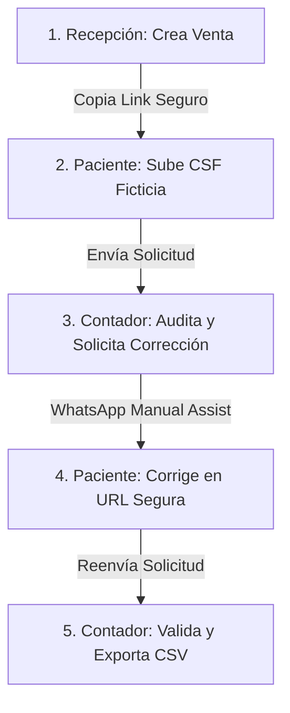

# FiscoBot — Manual de Demostración Externa Controlada

Este manual está diseñado para socios comerciales, gerentes de clínicas y contadores que deseen presentar o evaluar el funcionamiento de **FiscoBot (Factura Clínica)** en un entorno real pero controlado.

---

## 1. Declaración de Propósito y Alcance

> [!IMPORTANT]
> ### ⚠️ ADVERTENCIA DE SEGURIDAD Y CUMPLIMIENTO
> *   Este sistema se presenta **exclusivamente como una "Demo cloud controlada con datos ficticios"**.
> *   **Bajo ninguna circunstancia** debe promoverse o presentarse como una "producción operativa", "piloto real", o "sistema listo para datos, pacientes o constancias reales".
> *   Toda la información ingresada debe ser estrictamente ficticia. No se deben subir Constancias de Situación Fiscal (CSF) reales de contribuyentes vigentes.

### Mensaje Central del Producto:
> *"Las solicitudes de factura se pierden en WhatsApp, llegan incompletas y generan retrabajo. Factura Clínica organiza todo el proceso con códigos QR, formularios optimizados, lectura inteligente y prellenado de Constancias Fiscales en un panel seguro diseñado para la clínica y el contador."*

---

## 2. Acceso y Credenciales de la Demo

*   **URL de la Demo:** [https://fiscobot.vercel.app](https://fiscobot.vercel.app)
*   **Página Pública de la Clínica (Dental Río Colorado):**
    [https://fiscobot.vercel.app/factura/dental-rio-colorado](https://fiscobot.vercel.app/factura/dental-rio-colorado)

### Credenciales de Acceso Ficticias (Presets en Login):
*   **Recepcionista:** `recepcion@dentalrio.test`
    *Acceso:* Gestión de folios, ventas diarias y emisión de links.
*   **Contador:** `contador@dentalrio.test`
    *Acceso:* Auditoría contable, revisión de CSF, solicitud de corrección y descargas.
*   **Administrador:** `admin@dentalrio.test`
    *Acceso:* Configuración, visualización global y reportes.
*   **Contraseña común:** `Demo123456!`

---

## 3. Qué Mostrar y Qué No Mostrar

### ✅ Qué Mostrar:
1.  **UX Premium:** La interfaz fluida, el soporte para modo oscuro nativo, el diseño responsivo en móvil y las transiciones animadas.
2.  **Prellenado Inteligente:** Cómo al subir el PDF ficticio de la Constancia de Situación Fiscal (CSF), el formulario extrae de manera privada el régimen, razón social y código postal.
3.  **Seguridad y Privacidad:** Las solicitudes son privadas y el almacenamiento (bucket) está protegido con políticas estrictas.
4.  **WhatsApp Manual Assist:** La plantilla de mensaje generada de manera semiautomática para enviarse mediante el WhatsApp del propio negocio, evitando costes de APIs de terceros.
5.  **Flujo de Corrección por Token:** El ciclo seguro cuando el paciente corrige sus datos desde un link único provisto por el contador.

### ❌ Qué NO Mostrar:
1.  **Consola de Desarrollo:** Evitar abrir las herramientas de desarrollador (`F12`) durante presentaciones para mantener un tono comercial y fluido.
2.  **Llaves de API:** No mostrar bases de datos ni el dashboard de administración de Supabase.
3.  **Datos de Pacientes Reales:** Nunca usar nombres, RFCs o constancias de personas físicas o morales existentes.

---

## 4. Guion del Flujo Paso a Paso (5-7 Minutos)



### Paso 1: Recepción (Panel de Ventas)
1.  Iniciar sesión en `/login` usando las credenciales de Recepción.
2.  Mostrar el panel simplificado. Hacer clic en **"Crear venta"** -> **"Nueva venta"**.
3.  Ingresar un paciente ficticio (ej. `Paciente E2E Ficticio`), seleccionar el servicio `Consulta dental` y monto `$150.00`.
4.  Hacer clic en **"Guardar y generar link fiscal"**. Copiar el enlace resultante y cerrar sesión.

### Paso 2: Paciente (Solicitud de Factura)
1.  Abrir el enlace copiado en una pestaña en modo incógnito (simulando el celular del paciente).
2.  Arrastrar la constancia ficticia de prueba: `docs/qa/fixtures/csf_ana_gomez_626.pdf`.
3.  Mostrar cómo se prellenan los campos como el **Régimen Fiscal** y la **Razón Social**.
4.  Completar el correo del paciente como `paciente@example.com` y dar clic en **"Enviar datos para factura"**.

### Paso 3: Contador (Revisión y Rechazo)
1.  Regresar a `/login` e ingresar con las credenciales del Contador.
2.  Mostrar cómo la solicitud aparece con el estado `Recibida`.
3.  Hacer clic en **"Detalle"** y presionar **"Requiere corrección"**.
4.  Escribir el motivo: `"El RFC no coincide con la constancia de prueba."` y presionar **"Confirmar"**.
5.  Mostrar la ventana con el enlace de corrección y el texto listo para enviar por WhatsApp. Copiar el enlace y cerrar sesión.

### Paso 4: Paciente (Corrección)
1.  Pegar la URL de corrección en el navegador (ej. `https://fiscobot.vercel.app/factura/dental-rio-colorado?correction=<token>`).
2.  Mostrar la alerta roja donde se le indica el motivo de la corrección al paciente.
3.  Modificar el RFC a `XAXX010101001` y presionar **"Enviar datos para factura"**.

### Paso 5: Contador (Cierre y Exportación)
1.  Ingresar nuevamente como Contador.
2.  Confirmar en el listado que la solicitud ahora tiene el estado **"Corregida por paciente"** con el RFC modificado.
3.  Hacer clic en **"Exportar para contador"** para descargar el archivo CSV limpio y listo para cargarse en Coi/Excel.

---

## 5. Manejo de Preguntas Difíciles (Wording Comercial)

| Pregunta | Lo que NO debes decir | Lo que SÍ debes decir (Respuesta Oficial) |
|----------|-----------------------|-------------------------------------------|
| **¿Ya está conectado al SAT para facturar directo?** | *"Sí, timbra facturas automáticamente."* | *"FiscoBot es un MVP y Demo Cloud Controlada para organizar y validar los datos de los clientes. El timbrado real al SAT se realiza a través de su software de facturación actual o su PAC preferido, cargando el archivo CSV limpio y auditado que genera nuestro sistema."* |
| **¿Tiene API de WhatsApp propia?** | *"Sí, enviamos mensajes automáticos."* | *"El sistema utiliza WhatsApp Manual Assist, una funcionalidad que genera plantillas de mensajes personalizadas listas para que su personal las envíe en un clic usando su propio WhatsApp Business. Esto evita cargos mensuales extras de API y mantiene el control humano de la comunicación."* |
| **¿Está listo para usarse en mi clínica hoy?** | *"Sí, ya está en producción."* | *"Estamos en la fase de Demo Cloud Controlada y pruebas de usabilidad con datos ficticios. Actualmente evaluamos flujos de trabajo e interfaces con clínicas y contadores aliados para garantizar la seguridad antes de lanzar el piloto real con datos reales."* |
| **¿Qué tan seguras están las Constancias del Paciente?** | *"Están públicas en la nube."* | *"La seguridad es nuestra prioridad. Las constancias se almacenan en un bucket privado protegido por políticas de Row-Level Security (RLS) de Supabase. El acceso está restringido exclusivamente al contador asignado y los enlaces compartidos expiran de manera segura. El paciente nunca ve los datos de otros usuarios."* |

---

## 6. Procedimiento de Resiembra (Resecar la Demo)

Si durante las demostraciones el panel de la clínica se llena de solicitudes de prueba repetidas y deseas restablecer la demo a su estado inicial limpio, realiza los siguientes pasos en la consola local:

```bash
# 1. Asegúrate de estar en el directorio del proyecto
cd c:/Users/User/Documents/fiscobot

# 2. Resetea la base de datos remota con las migraciones y seed iniciales
npx supabase db reset --linked --yes
```

> [!CAUTION]
> ### 🚨 ADVERTENCIA DE ELIMINACIÓN DE DATOS
> El comando `supabase db reset --linked` borrará todas las solicitudes de factura registradas por usuarios externos en el dashboard y restablecerá los usuarios de prueba. Úsalo únicamente entre demostraciones importantes.
