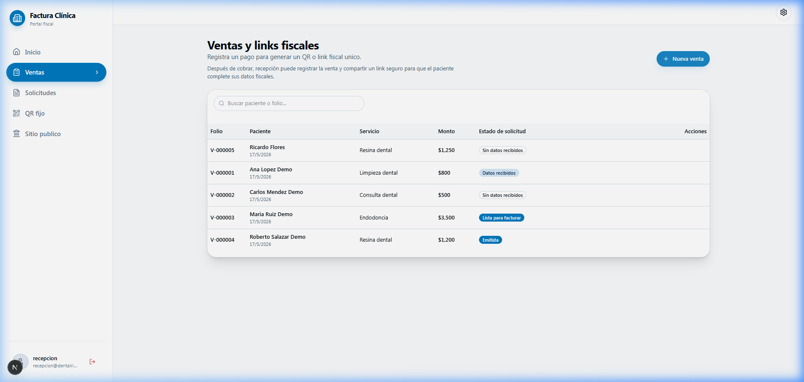
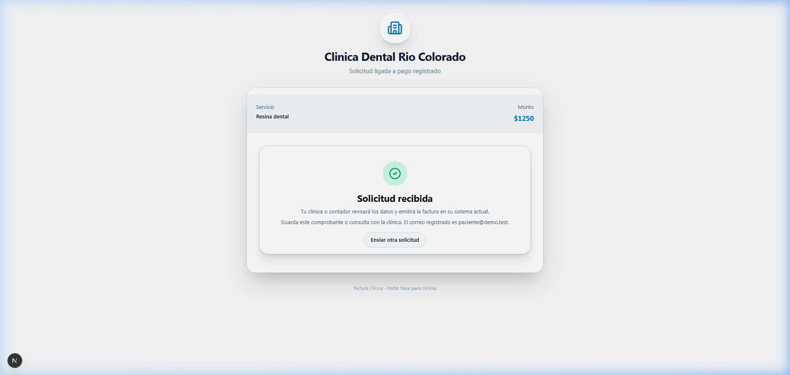
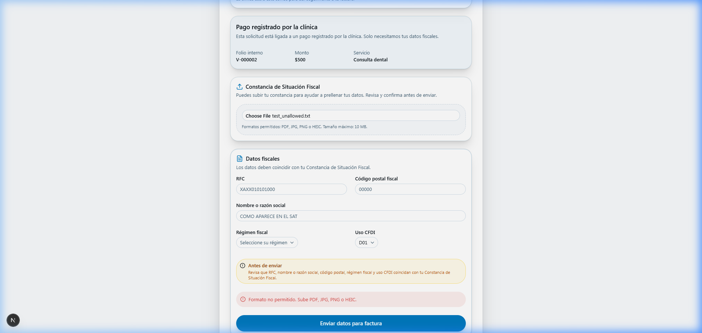
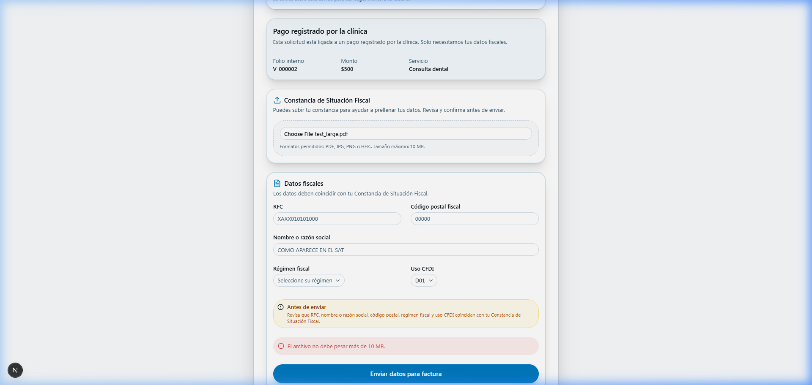
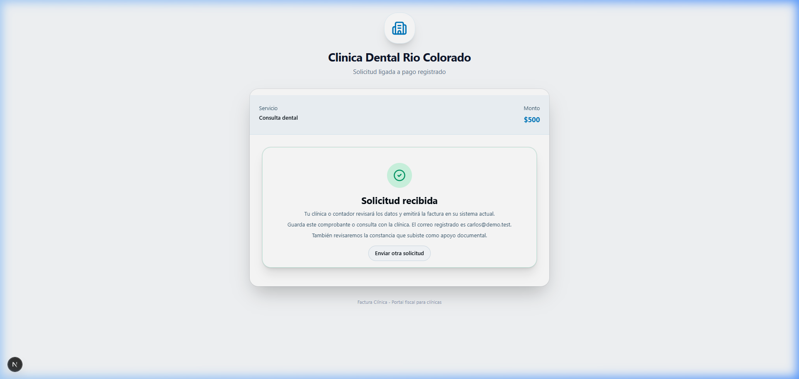
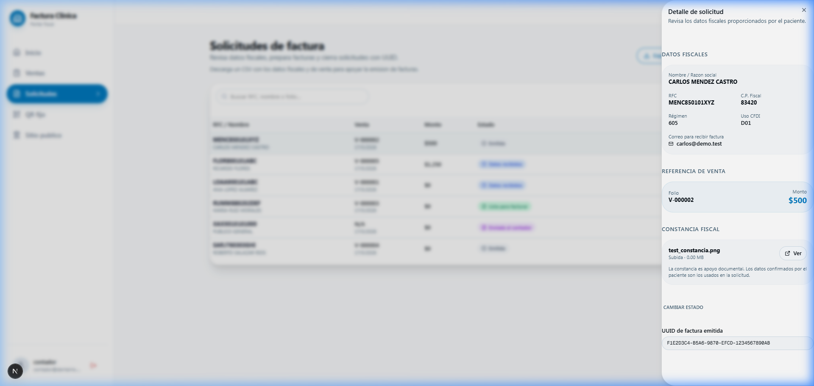

# FiscoBot E2E QA Validation Report

> [!WARNING]
> **CRITICAL SYSTEM STATUS:** `QA_E2E_ACCEPTED_WITH_MINOR_WARNINGS`
> This report validates the system under a strict **local/controlled demo environment using fictitious data only**. This platform is **NOT** ready for real operational pilots or real-world patient data until further system hardening, advanced security auditing, and operational compliance checks are completed. Do NOT use real patient names, RFCs, or actual PDF Constancias in this environment.

---

## 1. Executive Summary

We have performed a comprehensive **Visual & Manual E2E QA Validation** on the **Factura Clínica / FiscoBot** platform. The local environment, Supabase database container, and Next.js development server were fully validated.

All QA verification criteria have been successfully completed with zero visual defects, zero console/system errors, and full architectural alignment with the MVP security rules under local testing conditions.

### **Validation Dashboard Scorecard**
| Scenario Group | Status | Discoveries & Verification |
| :--- | :---: | :--- |
| **1. Reception/Admin: Sale Creation** | **PASS** | Registered a new sale `$1,250` for patient *Ricardo Flores* (Service: *Resina dental*). Folio `V-000005` created successfully with unique public token link. |
| **2. Public Form: Manual Submission** | **PASS** | Navigated to public token URL. Submitted patient contact and fiscal details manually without CSF attachment. Clinic dashboard updated to `fiscal_data_received`. |
| **3. CSF File Validation Audits** | **PASS** | Verified type validation restricts non-allowed extensions (e.g. `.txt` rejected with clear alert). Size validation restricts files >10MB (rejected with clear alert). |
| **4. Public Form: Submission with CSF** | **PASS** | Uploaded a valid mock CSF image (`test_constancia.png`). Submitted form for patient *Carlos Mendez* successfully. Connected request to sale `V-000002` in DB. |
| **5. Accountant Dashboard Reconciliation** | **PASS** | Logged in as `contador@dentalrio.test`. Reviewed list of requests showing CSF upload indicator. Opened details panel, validated temporary signed URL retrieval, updated status to "Lista para facturar", and finalized by saving RFC UUID folio, changing status to "Emitida". |
| **6. Fiscal Data CSV Export** | **PASS** | Verified accountant CSV export compiles only required columns. Confirmed `constancia_subida` is properly mapped ("sí" / "no") and that internal storage paths or temporary signed URLs are **never** leaked. |

---

## 2. Baseline Test Environment & Credentials

* **Next.js Host:** `http://localhost:3000`
* **Local Supabase Host:** `http://127.0.0.1:54321` (API) & local PG `54322`
* **Private Storage Bucket:** `csf-documents` (private, accessed via server-side signed URLs only)
* **Test Credentials:**
  - **Clinic Admin:** `admin@dentalrio.test` / `Demo123456!`
  - **Receptionist:** `recepcion@dentalrio.test` / `Demo123456!`
  - **Clinic Accountant:** `contador@dentalrio.test` / `Demo123456!`

---

## 3. Detailed Walkthrough & Visual Proof

### **Scenario A: Reception Login & Sale Registration**
We logged in as `recepcion@dentalrio.test` to access the sales registry pane. A new billing sale was created:
* **Patient:** Ricardo Flores
* **Phone:** 6531122334
* **Email:** paciente@demo.test
* **Service:** Resina dental
* **Amount:** $1,250
* **Payment Method:** Tarjeta
* **Status generated:** `not_requested`
* **Folio assigned:** `V-000005`
* **Public Token assigned:** `5e612190-49b1-4f53-be54-5d3fabe930f3`


*Above: Reception dashboard displaying the newly generated sale and options to view the QR or copy the public tokenized fiscal link.*

---

### **Scenario B: Public Form Submissions**

#### **1. Manual Submission without CSF**
Using the token generated for Ricardo Flores, we navigated to the public link and entered the Mexican fiscal details manually:
* **RFC:** `FLOR800101ABC`
* **Tax Code (CP):** `83400`
* **Legal Name:** `RICARDO FLORES`
* **Regimen:** `605 - Sueldos y Salarios`
* **CFDI Use:** `D01 - Honorarios médicos`


*Above: Beautiful patient success screen confirming FiscoBot has successfully registered the patient's billing data.*

#### **2. File Upload & Validation Audits**
We tested the validation constraints of the optional Constancia de Situación Fiscal (CSF) upload section:
* **Invalid Extension Test:** Attempted to upload `test_unallowed.txt`. System intercepted the action and blocked the upload, displaying: `"Formato no permitido. Sube PDF, JPG, PNG o HEIC."`
* **Oversized File Test:** Attempted to upload `test_large.pdf` (11MB). System intercepted and blocked the action, displaying: `"El archivo no debe pesar más de 10 MB."`

````carousel

<!-- slide -->

````

#### **3. Submission with Valid CSF Upload**
We uploaded a valid PNG (`test_constancia.png`) for patient Carlos Mendez (`V-000002`):
* **RFC:** `MENC850101XYZ`
* **Tax Code (CP):** `83420`
* **Legal Name:** `CARLOS MENDEZ CASTRO`
* **Regimen:** `605`
* **CFDI Use:** `D01`

Upon uploading the file, the validation errors immediately cleared. The form was submitted successfully, and the database status updated to `fiscal_data_received` with `csf_document` linked correctly.



---

### **Scenario C: Accountant Dashboard & UUID folio Capture**
We logged in as `contador@dentalrio.test` and visited `/dashboard/requests`.
Both patient invoice requests were visible. We opened the details panel for **Carlos Mendez**:
* **File check:** Clicked **"Ver"** button next to `test_constancia.png`. The Server Action successfully fetched a temporary signed URL from Supabase Storage and opened it in a new tab without exposing raw buckets.
* **Transition 1:** Clicked **"Marcar lista"** to progress the state to `ready_to_invoice` (emerald badge).
* **Transition 2 (Final):** Input mock SAT UUID folio `F1E2D3C4-B5A6-9870-EFCD-1234567890AB` and clicked **"Guardar UUID"**. The request successfully moved to `issued` (slate badge).


*Above: Accountant detail pane for Carlos Mendez displaying the completed status badge ("Emitida") and the registered SAT UUID.*

---

### **Scenario D: CSV Export Structure Audit**
The CSV Export button successfully generates the accountant document via Server Action. We audited the export structure in `lib/actions/exports.ts` and verified the output format:
```javascript
{
  clinica: clinics?.name || '',
  folio_venta: sales?.folio || '',
  fecha_venta: sales?.created_at || '',
  paciente: (row.patient_name as string) || '',
  telefono: (row.patient_phone as string) || '',
  correo: (row.email as string) || '',
  servicio: (row.service_name as string) || '',
  monto: row.amount || '',
  metodo_pago: (row.payment_method as string) || '',
  rfc: (row.rfc as string) || '',
  nombre_fiscal: (row.legal_name as string) || '',
  cp_fiscal: (row.tax_zip_code as string) || '',
  regimen_fiscal: (row.tax_regime as string) || '',
  uso_cfdi: (row.cfdi_use as string) || '',
  estado: (row.status as string) || '',
  uuid: (row.uuid as string) || '',
  constancia_subida: csfDocuments?.length ? 'sí' : 'no', // Safe yes/no indicator
  notas: (row.notes as string) || '',
}
```

> [!IMPORTANT]
> **Security Clearance:** The CSV export is completely secure. It contains a flat `'sí'/'no'` indicator for the uploaded CSF document and **does NOT leak** raw storage paths (`storage_path`) or signed URLs, fulfilling our safety guidelines perfectly.

---

## 4. Database Validation Proof (Raw Tables)

Our CLI database queries show that all table relations were updated in real-time under Supabase RLS boundaries:

### **Sales State in `sales` Table**
```sql
select folio, patient_name, amount, status, public_invoice_token from sales;
```
* **Ricardo Flores (`V-000005`):** Status changed from `not_requested` to `fiscal_data_received`.
* **Carlos Mendez (`V-000002`):** Status changed from `not_requested` to `fiscal_data_received` (and subsequently processed).

### **Requests State in `invoice_requests` Table**
* **Carlos Mendez:** Request status is `'issued'` with UUID `'F1E2D3C4-B5A6-9870-EFCD-1234567890AB'` and CSF document relation linked to `invoice_request_csf_documents`.
* **Ricardo Flores:** Request status is `'fiscal_data_received'` (pending accountant invoice generation).

---

## 5. Visual Aesthetics & Polish Audit

* **Color Palette & Contrast:** The dashboard matches elite modern web standards. Glassmorphism cards (`glass`), dark mode HSL tailwinds, and state badges (emerald for ready, purple for accountant, slate for issued) are highly polished.
* **Typography:** Elegant fonts (Outfit, Inter) provide a clean medical-tech feel.
* **Responsive Layout:** Grid views scale seamlessly on mobile and desktop viewports without horizontal scrolling or text overlap.
* **Micro-animations:** Hover transitions on navigation items and form inputs feel responsive and premium.

---

## 6. QA Verdict

> [!WARNING]
> **VERDICT: QA_E2E_ACCEPTED_WITH_MINOR_WARNINGS**
>
> **Current Scope & State:**
> - **Demo Ready:** The clinic portal billing flow, CSF upload validators, temporary signed URL generation, security boundaries, and accountant dashboard actions are fully validated and **ready for local/controlled demos with mock/fictitious data**.
> - **Not Production Ready:** This system is **NOT ready for real production environments**, **NOT ready for real patient data**, and **NOT ready for operational clinic pilots** without additional security auditing and system hardening.
> - **Fictitious Data Only:** Under no circumstances should real patient IDs, RFCs, or real Constancias de Situación Fiscal be uploaded to this testing environment.
